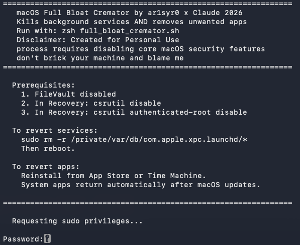

# macOS Full Bloat Cremator 
### by ar1syr0 x claude
### “Disclaimer: I made this for my personal use. I’m publishing it for inspiration....”
---

> I was tired of opening Launchpad and seeing Stocks, Chess, and Tips staring back at me
> like uninvited guests at a party I didn't throw. This guide documents how I took back
> control of my Mac, silenced Apple's background surveillance circus, and evicted every
> app I never asked for. You're welcome.

---

## Before You Touch Anything — Read This

This process requires disabling core macOS security features.
That's not a warning to scare you off — it's a warning so you don't brick your machine
and blame me. Do it wrong and you'll be staring at a flashing folder of doom.

Also: **make a backup first**. Time Machine. Carbon Copy Cloner. A USB stick. Anything.
No backup = no sympathy.

---

## Prerequisites

### 1. Disable FileVault (App Removal Only)

If FileVault is enabled, the system volume cannot be remounted as writable.
The service-killing part of the script is fine with FileVault on — but if you want
to actually delete apps, FileVault needs to go first.

**System Settings → Privacy & Security → FileVault → Turn Off FileVault**

Decryption takes a while depending on drive size. Make a coffee. Come back.
Once it says "FileVault is turned off" you're good to proceed.

> You can re-enable FileVault after everything is done.

---

### 2. Disable SIP (System Integrity Protection)

SIP is the bouncer that stops anything — including you — from modifying system files.
Respectable in theory. Annoying when you're trying to evict Chess.app.

**Apple Silicon (M1/M2/M3/M4):**

1. Shut down completely
2. Press and hold the **Power button** until "Loading startup options" appears
3. Click **Options → Continue**
4. Select your user and enter your password
5. Go to **Utilities → Terminal**
6. Run:
   ```
   csrutil disable
   ```
7. Restart normally


---

### 3. Disable Authenticated Root (SSV)

This is the one most guides forget to mention — and the one that will leave you
screaming `Read-only file system` at your terminal at 11pm on a Saturday.

Since macOS Big Sur, `/System` lives on a cryptographically sealed APFS snapshot.
Even with SIP off, `sudo rm` bounces off it like a rubber ball.
`csrutil authenticated-root disable` breaks the seal.

**Go back into Recovery Mode (same steps as above) and run both commands:**

```
csrutil disable
csrutil authenticated-root disable
```

Reboot. Now you mean business.

**Verify both are off after reboot:**
```zsh
csrutil status
# Should say: System Integrity Protection status: disabled

csrutil authenticated-root status
# Should say: Authenticated Root status: disabled
```

If both say disabled — you're cleared for takeoff.

---

## The Script

The script runs in two phases:

### Phase 1 — Service Cremation

Silences Apple's background service army. This includes:

- **Siri and all AI services** — assistantd, intelligenceflowd, generativeexperiencesd, etc.
- **Telemetry and analytics** — analyticsd, audioanalyticsd, wifianalyticsd, ecosystemanalyticsd
- **iCloud sync daemons** — cloudd, cloudphotod, CloudSettingsSyncAgent
- **Location services** — CoreLocationAgent, locationd, routined
- **Find My** — findmymac, findmybeaconingd, icloud.searchpartyd
- **Apple Intelligence** — modelmanagerd, mediaanalysisd, knowledgeconstructiond
- **Screen sharing and Sidecar** — screensharing, sidecar-relay, rapportd
- **Game Center, Finance, News** — gamed, financed, newsd

Changes are written to:
```
/private/var/db/com.apple.xpc.launchd/disabled.plist
/private/var/db/com.apple.xpc.launchd/disabled.501.plist
```

Phase 1 is **safe to run with FileVault and SIP enabled** — it only touches launchd plists,
not the system volume.

**To revert Phase 1 entirely:**
```zsh
sudo rm -r /private/var/db/com.apple.xpc.launchd/*
# Then reboot
```

---

### Phase 2 — App Eviction

Dynamically scans your Mac for removable apps and presents a native macOS
selection dialog. You pick what goes. Nothing is deleted without your explicit selection.

- Apps in `/System/Applications` are labelled **[returns after updates]** — Apple will
  resurrect them next time a system update runs. You can re-run the script after updates.
- Apps in `/Applications` are labelled **[permanent]** — gone for good unless you
  reinstall from the App Store.

Core system apps (Finder, Terminal, Disk Utility, Safari, etc.) are excluded from
the list entirely and cannot be selected. The script won't let you shoot yourself in the foot.
Probably.

**To revert Phase 2:**
Reinstall removed apps from the App Store, or restore from your backup (you did make one, right?).

---

## Running the Script

```zsh
# Save the script
nano ~/full_bloat_cremator.sh

# Make it executable
chmod +x ~/full_bloat_cremator.sh

# Run it
zsh ~/full_bloat_cremator.sh
```

The script will:
1. Ask for your sudo password upfront and keep it alive throughout
2. Quietly disable all background services with live output per service
3. Scan your installed apps and present the removal dialog
4. Verify each deletion actually happened before reporting success
5. Tell you to reboot when it's done

---

## After the Script

**Reboot your Mac.** This is not optional. Services are disabled at the launchd level
and the remounted system volume needs to reseal properly on restart.

---

## Re-enabling Security (Recommended)

Once everything is done and you've rebooted, you can re-enable SIP and SSV
to restore your security posture. The disabled service entries in the launchd plists
will persist — removed apps will not return until a macOS update pushes them back.

**Back in Recovery Mode:**
```
csrutil enable
csrutil authenticated-root enable
```

Re-enable FileVault if you want it back:
**System Settings → Privacy & Security → FileVault → Turn On FileVault**

---

## Tested On

| macOS Version | Services | App Removal |
|---|---|---|
| Tahoe (26) | Yes | Yes |

---

## Quick Reference

| Task | Command |
|---|---|
| Disable SIP | `csrutil disable` (Recovery) |
| Disable SSV | `csrutil authenticated-root disable` (Recovery) |
| Re-enable SIP | `csrutil enable` (Recovery) |
| Re-enable SSV | `csrutil authenticated-root enable` (Recovery) |
| Verify SIP status | `csrutil status` |
| Verify SSV status | `csrutil authenticated-root status` |
| Revert all services | `sudo rm -r /private/var/db/com.apple.xpc.launchd/*` then reboot |
| Run the script | `zsh ~/full_bloat_cremator.sh` |

---

### Example/Gui Snippets




 

*ar1syr0 x claude. Built out of spite, refined out of necessity.*
